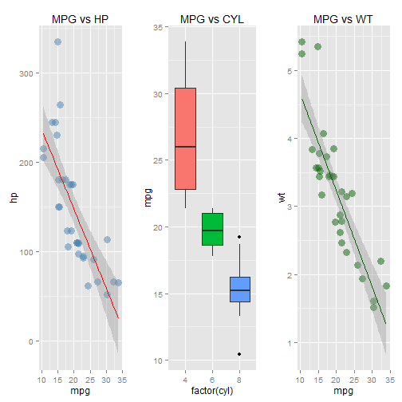
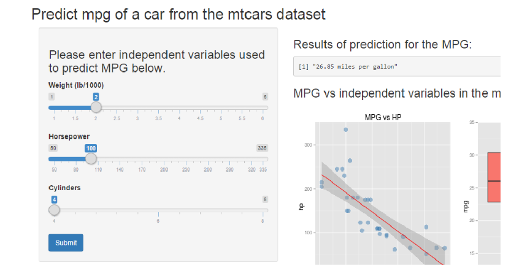

## Introduction

This presentation serves to pitch the App created for the JHU Data Science's course called 'Developing Data Products' on Coursera. For the project, an App was created which uses the mtcars data set and predicts the effect of the HP, CYL and WT independent variables on the MPG of a hypothetical car.

The App being referenced to can be found here:
[Shiny App](http://hrishank.shinyapps.io/Project)

The App contains three sliders, one each for the HP, CYL, and WT such that you can enter this information and click the 'Submit' button to predict how many miles per gallon such a car would get. This result is displayed under the "Results of prediction for the MPG" heading.


```r
head(mtcars, 3)
```

```
##                mpg cyl disp  hp drat    wt  qsec vs am gear carb
## Mazda RX4     21.0   6  160 110 3.90 2.620 16.46  0  1    4    4
## Mazda RX4 Wag 21.0   6  160 110 3.90 2.875 17.02  0  1    4    4
## Datsun 710    22.8   4  108  93 3.85 2.320 18.61  1  1    4    1
```


--- .class #id 

## The linear regression formula used for the prediction


```r
data(mtcars)
fit <- lm(mpg ~ cyl + hp + wt, data = mtcars)
summary(fit)$coef
```

```
##               Estimate Std. Error   t value     Pr(>|t|)
## (Intercept) 38.7517874 1.78686403 21.687038 4.799399e-19
## cyl         -0.9416168 0.55091638 -1.709183 9.848010e-02
## hp          -0.0180381 0.01187625 -1.518838 1.400152e-01
## wt          -3.1669731 0.74057588 -4.276365 1.994765e-04
```

From the results above, we see that each increment in weight has the highest negative impact of the 3 variables on the MPG

--- .class #id 

## How do the independent variables interact with MPG?

 


--- .class #id 

## Prediction of MPG on the Shiny IO App

The "26.85" number will change to something else once at least one of the inputs is changed and the Submit button is clicked

 

--- .class #id 

